<div align="center">


# 🌾 FarmGPT AI

**An AI-native, multi-agent farming co-pilot for Indian smallholder farmers — diagnose crop diseases from a photo, get hyper-local weather & mandi advice, and generate structured farm plans in seconds.**

[]()
[]()
[](./LICENSE)
[]()
[]()
[]()
[]()
[]()
[]()
[]()
[]()

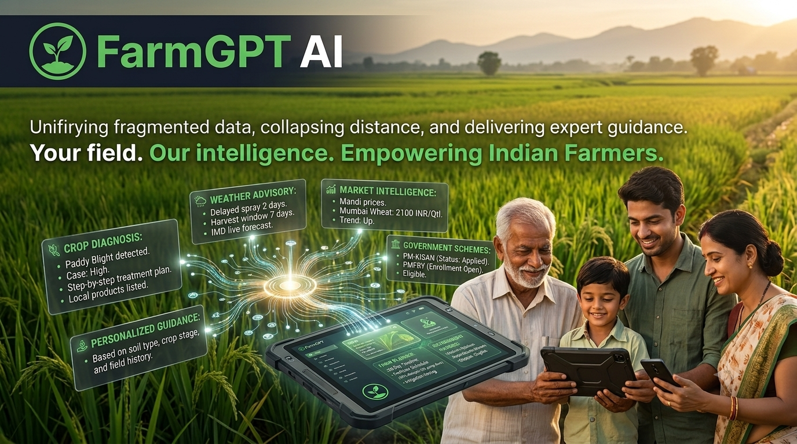

*Built for the Kaggle AI Agents Capstone Project — a production-grade demonstration of multi-agent orchestration, multimodal reasoning, and edge-deployed RAG.*

</div>

---

## 📑 Table of Contents

- [Problem Statement](#-problem-statement)
- [Solution Overview](#-solution-overview)
- [Key Features](#-key-features)
- [Architecture Overview](#-architecture-overview)
- [Screenshots](#-screenshots)
- [Tech Stack](#-tech-stack)
- [Folder Structure](#-folder-structure)
- [Database Design](#-database-design)
- [AI Architecture](#-ai-architecture)
- [Authentication](#-authentication)
- [Installation](#-installation)
- [Running Locally](#-running-locally)
- [Building for Production](#-building-for-production)
- [Deploying](#-deploying)
- [How AI Works](#-how-ai-works)
- [Security](#-security)
- [Performance Optimizations](#-performance-optimizations)
- [Challenges Faced](#-challenges-faced)
- [Future Roadmap](#-future-roadmap)
- [Contributing](#-contributing)
- [License](#-license)
- [Author](#-author)
- [Support](#-support)
- [Acknowledgements](#-acknowledgements)
- [Project Statistics](#-project-statistics)
- [Why This Project Matters](#-why-this-project-matters)

---

## 🌍 Problem Statement

India has **over 120 million farmers**, most of them smallholders working under 2 hectares of land. Every season they face the same crushing questions:

- **"What disease is eating my crop, and how do I stop it before I lose the harvest?"**
- **"Should I irrigate today, or is rain coming?"**
- **"What's the mandi price in the next district — should I sell now or wait?"**
- **"Am I eligible for PM-KISAN / PMFBY / KCC, and how do I actually apply?"**
- **"How much urea, DAP, and MOP should I put on my 2-acre wheat field this week?"**

### Existing Limitations

| Existing Option | Why It Fails the Farmer |
|---|---|
| Krishi Vigyan Kendras | Understaffed, reachable only in office hours, often far from the village |
| Agri-input dealers | Financially incentivized to over-prescribe pesticides and fertilizers |
| Generic weather apps | City-level forecasts, no farming context ("should I spray?") |
| Government portals | Text-heavy, English/Hindi only, hard to navigate on a 2G phone |
| ChatGPT / generic LLMs | No image diagnosis, no local mandi data, no scheme grounding, no memory |

### Why AI Is Needed

A farmer needs a **single, always-on, multilingual expert** that can *see* their crop, *know* their location, *understand* their language, and *reason* across weather, disease, market, and government-scheme domains simultaneously. No human advisor can be that. A well-orchestrated AI agent system can.

### Why FarmGPT AI Is Different

- **Multi-agent, not monolithic** — a dedicated specialist for disease, weather, market, government, fertilizer, and general queries. Each agent has its own system prompt, temperature, and grounding rules.
- **Multimodal** — upload a leaf photo, get a diagnosis + treatment plan in the same chat turn.
- **Structured JSON responses** — the AI doesn't just return prose; it returns typed cards (weather panels, price tables, scheme lists) that the UI renders as rich components.
- **Edge-deployed** — runs on Cloudflare Workers via TanStack Start, meaning single-digit millisecond cold starts even in rural network conditions.
- **Secure by default** — Supabase RLS, server-side auth middleware, no service-role key in the browser, role-based access via a dedicated `user_roles` table (no privilege escalation).

---

## 💡 Solution Overview

**FarmGPT AI is a chat-first, agent-orchestrated farming assistant.** A farmer opens the app, types (or speaks in the roadmap) a question in plain language, and an **Intent Router** classifies the message and hands it off to the right specialist agent. The agent calls Google Gemini 3 Flash through the Lovable AI Gateway, streams a response, persists it to the farmer's chat history, and — where applicable — writes a structured `report` row that becomes a permanent, shareable artifact.

Beyond chat, the app ships with dedicated workspaces:

- **Dashboard** — at-a-glance farm health, recent scans, weather widget
- **Disease Scanner** — camera-first image diagnosis with follow-up Q&A
- **Farm Planner** — generates a season-long, JSON-structured crop plan
- **Command Center** — one-tap, AI-generated "what should I do this week" briefing
- **Market Intelligence** — mandi price advisory
- **Weather** — farming-focused weather with spray/irrigate/harvest recommendations
- **Reports** — history of every AI-generated artifact
- **Farm Profile & Settings** — location, crops, language, unit preferences

---

## ✨ Key Features

| Feature | Description |
|---|---|
| 🧠 **Multi-Agent AI System** | 6 specialized agents (Disease, Weather, Market, Government, Fertilizer, General) orchestrated by an Intent Router |
| 🌿 **Crop Disease Scanner** | Upload a leaf photo → get disease name, cause, severity, and step-by-step treatment plan with locally-available products and dosages |
| 💬 **Multimodal Chat** | Text + image chat with per-conversation memory, saved to Supabase with RLS isolation |
| 🌦️ **Weather Advisory** | Farming-context forecasts: should you irrigate, spray, or harvest today? |
| 📈 **Mandi Market Intelligence** | AI-reasoned price trends and sell/hold guidance |
| 🏛️ **Government Schemes Assistant** | Grounded explanations of PM-KISAN, PM-KUSUM, PMFBY, KCC, eligibility, and application steps |
| 🌱 **Fertilizer & Irrigation Planner** | NPK schedules, urea/DAP/MOP dosages, drip/flood/sprinkler timing per crop stage |
| 📋 **AI Farm Planner** | Generates full season plans as structured JSON, rendered as rich cards |
| 🎯 **Command Center** | One-click AI briefing: "Here's what your farm needs this week" |
| 📄 **Persistent Reports** | Every AI artifact is saved to a `reports` table and browsable forever |
| 🔐 **Google + Email Auth** | OAuth via Lovable Cloud Auth with a dedicated `/auth/callback` token-exchange route |
| 🛡️ **Row-Level Security** | Every user-facing table is RLS-scoped by `auth.uid()` |
| 👥 **Role-Based Access** | Separate `user_roles` table + `has_role()` security-definer function (no privilege escalation) |
| ⚡ **Edge-Deployed** | Ships as a Cloudflare Worker via TanStack Start — sub-100ms TTFB globally |
| 📱 **Fully Responsive** | Mobile-first UI built on shadcn/ui + Tailwind v4 |
| 🌗 **Dark Mode** | Semantic design tokens, first-class light/dark theming |
| 🧾 **Follow-Up Q&A on Scans** | Ask contextual questions about a previous diagnosis without re-uploading the image |
| 🔎 **Type-Safe Server Functions** | Every backend call is a typed `createServerFn` RPC — no untyped `fetch`es |
| 🧪 **Zod-Validated Inputs** | Every server function validates its input schema |
| 📊 **Structured JSON Mode** | Planner & Command Center use Gemini JSON mode + tolerant parser for reliable structured output |

---

## 🏗️ Architecture Overview

FarmGPT AI is a **full-stack, edge-native React application** with a strict separation between:

- **Presentation** — React 19 components under `src/components/` and `src/routes/`
- **Server RPC** — typed `createServerFn` handlers under `src/lib/**/*.functions.ts`
- **Server-only helpers** — `*.server.ts` modules never bundled into the client (AI Gateway calls, admin Supabase client)
- **Data** — Supabase Postgres with RLS on every user-facing table

### System Architecture

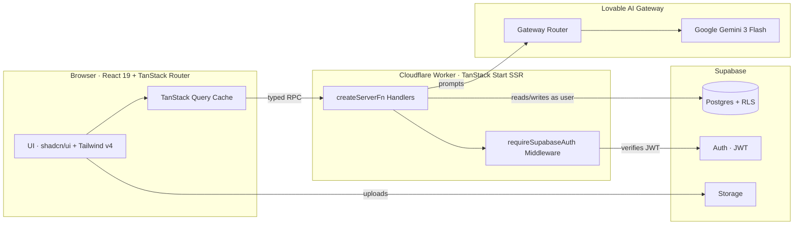

### AI Agent Architecture

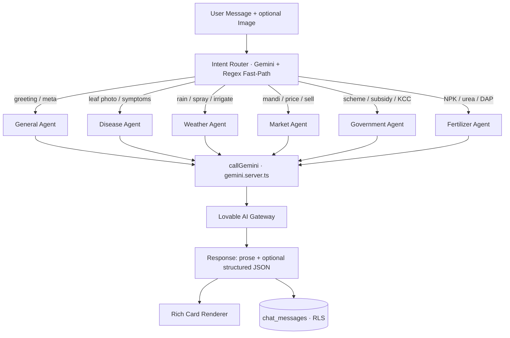

### Authentication Flow

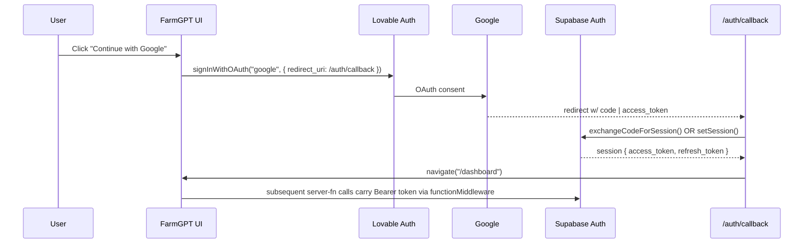

### User Workflow

```mermaid
flowchart LR
    L[Landing /] --> A{Authed?}
    A -- No --> LI[Login / Register]
    LI --> CB[/auth/callback]
    CB --> D[Dashboard]
    A -- Yes --> D
    D --> C[Chat]
    D --> DS[Disease Scanner]
    D --> FP[Farm Planner]
    D --> CC[Command Center]
    D --> M[Market]
    D --> W[Weather]
    D --> R[Reports]
    D --> P[Farm Profile]
```

### Request Flow (Typed RPC)

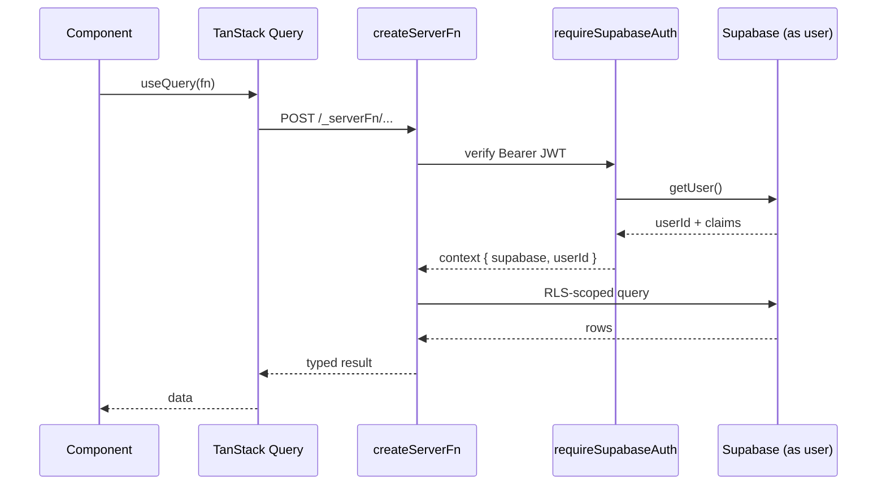

### Chat Flow

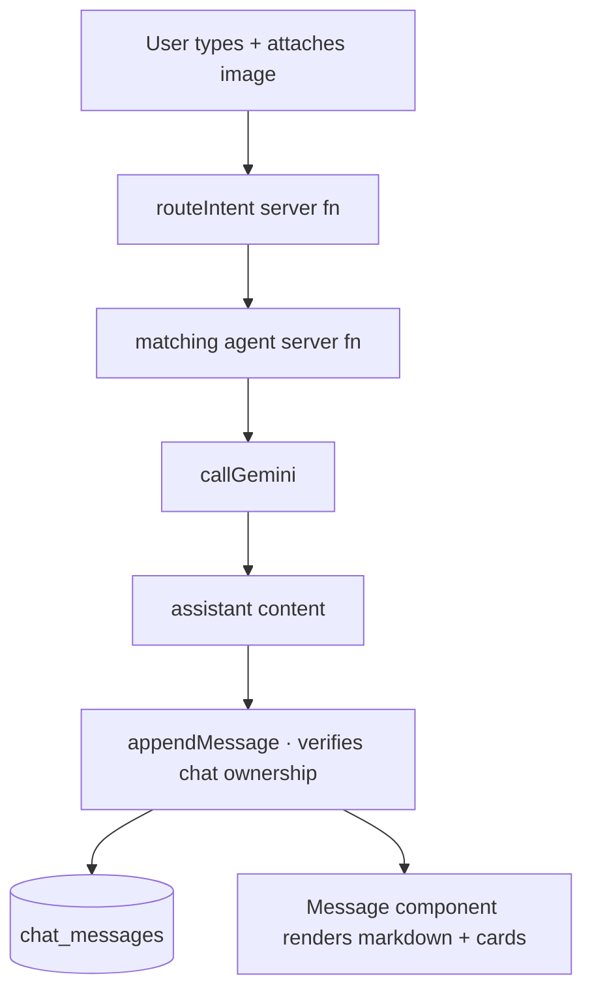

### Disease Diagnosis Flow

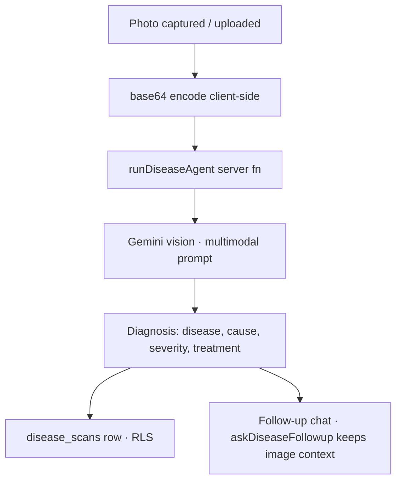

### Report Generation Flow

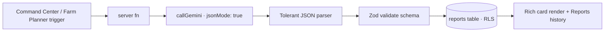

---

## 📸 Screenshots

| | |
|---|---|
|  | 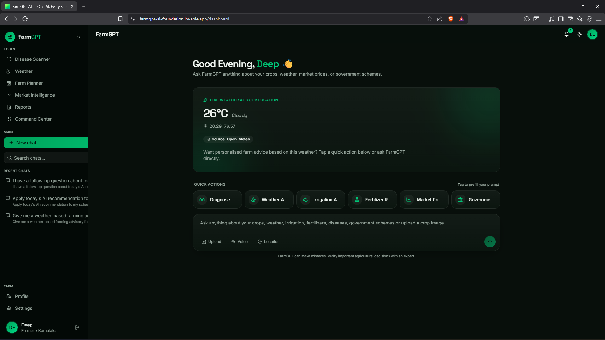 |
| 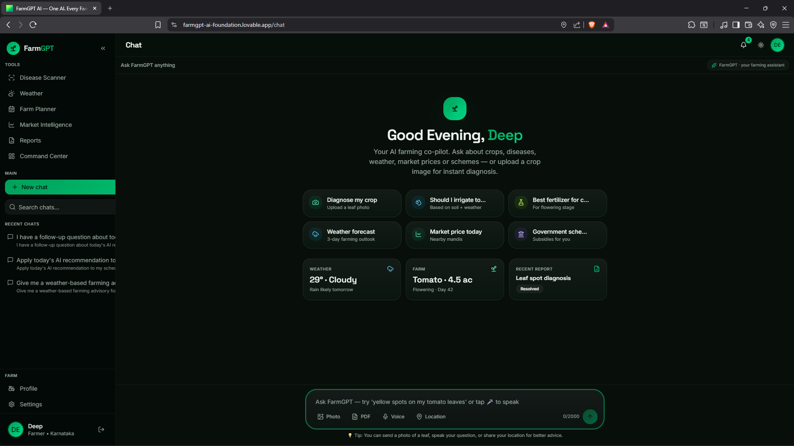 | 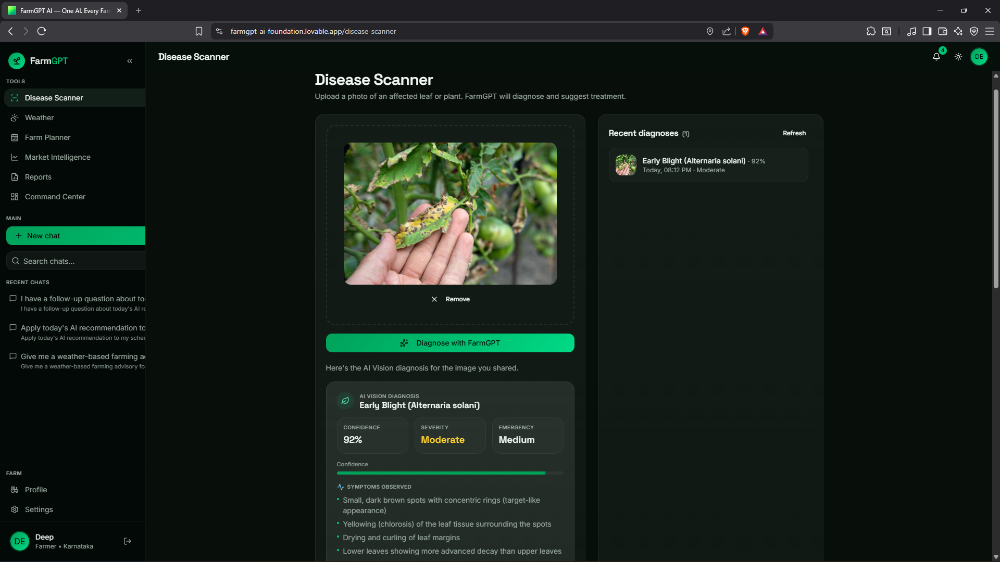 |
| 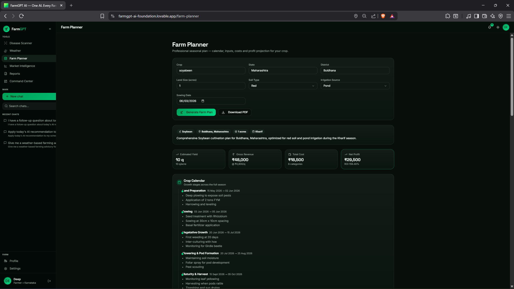 | 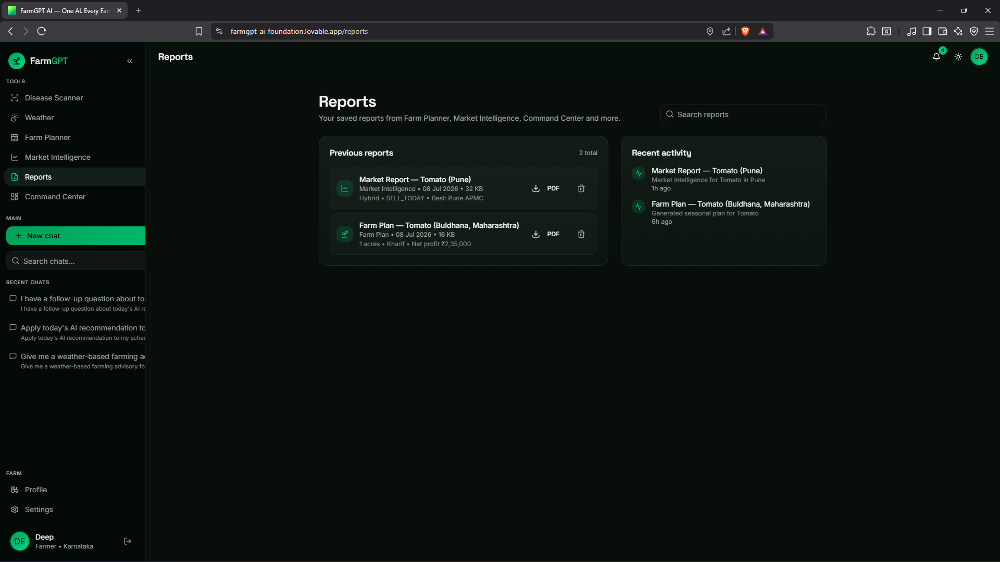 |
| 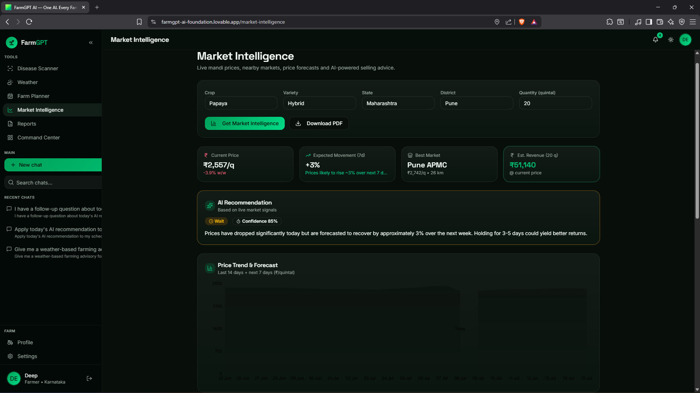 | 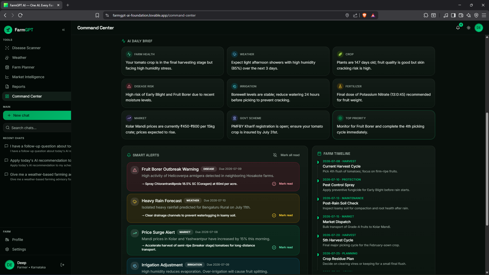 |
| 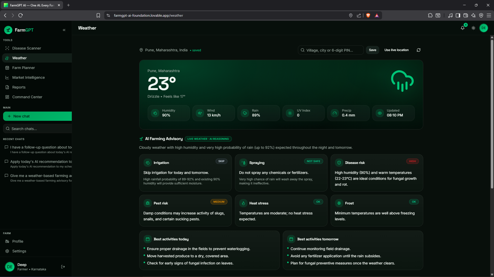 | 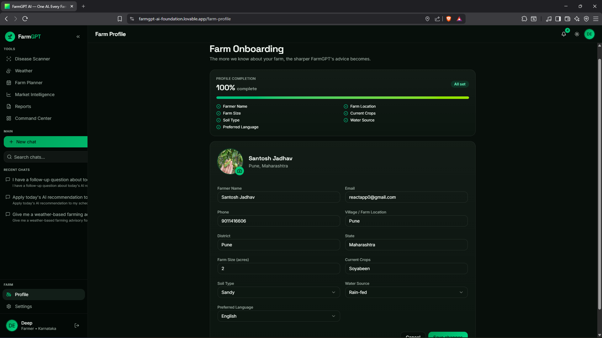 |

---

## 🛠️ Tech Stack

| Layer | Technology |
|---|---|
| **Frontend Framework** | React 19, TanStack Start v1 (SSR + file-based routing), TanStack Router, TanStack Query |
| **Language** | TypeScript 5 (strict mode) |
| **Styling** | Tailwind CSS v4 (native `@import`, semantic tokens), shadcn/ui, Radix Primitives, `class-variance-authority`, `tailwind-merge` |
| **Icons & UI** | Lucide React, Sonner (toasts), Vaul (drawers) |
| **Backend Runtime** | TanStack Start server functions on **Cloudflare Workers** (edge) with `nodejs_compat` |
| **Database** | Supabase Postgres 15 with Row-Level Security |
| **Authentication** | Supabase Auth (email + password) + Lovable Cloud Auth (Google OAuth) with custom `/auth/callback` token exchange |
| **AI Gateway** | Lovable AI Gateway (`ai.gateway.lovable.dev`) |
| **AI Model** | Google **Gemini 3 Flash Preview** (`google/gemini-3-flash-preview`), multimodal + JSON mode |
| **Validation** | Zod |
| **Hosting** | Lovable (primary), Cloudflare Workers-compatible, deployable to Vercel/Netlify edge |
| **Build Tool** | Vite 7 |
| **Package Manager** | Bun (with `bun.lock`) |
| **Linting / Format** | ESLint, Prettier |
| **Type Checking** | `tsgo` |

---

## 📁 Folder Structure

```text
farmgpt-ai/
├── src/
│   ├── routes/                          # File-based routes (TanStack Start)
│   │   ├── __root.tsx                   # HTML shell, head metadata, providers
│   │   ├── index.tsx                    # Landing page + legacy token handoff
│   │   ├── login.tsx                    # Email + Google sign-in
│   │   ├── register.tsx                 # Account creation
│   │   ├── forgot-password.tsx          # Password reset request
│   │   ├── reset-password.tsx           # Password reset form
│   │   ├── auth.callback.tsx            # OAuth token exchange (code + hash)
│   │   ├── _workspace.tsx               # Authenticated layout (sidebar + topbar)
│   │   ├── _workspace.dashboard.tsx     # Farm dashboard
│   │   ├── _workspace.chat.tsx          # Multi-agent chat
│   │   ├── _workspace.disease-scanner.tsx
│   │   ├── _workspace.farm-planner.tsx
│   │   ├── _workspace.command-center.tsx
│   │   ├── _workspace.market-intelligence.tsx
│   │   ├── _workspace.weather.tsx
│   │   ├── _workspace.reports.tsx
│   │   ├── _workspace.farm-profile.tsx
│   │   └── _workspace.settings.tsx
│   │
│   ├── components/
│   │   ├── farmgpt/                     # App-specific components
│   │   │   ├── AppSidebar.tsx
│   │   │   ├── AppTopbar.tsx
│   │   │   ├── AuthShell.tsx
│   │   │   ├── Logo.tsx
│   │   │   ├── PromptBox.tsx
│   │   │   └── chat/                    # Chat UI (Message, RichCards, Composer, History, EmptyState)
│   │   └── ui/                          # shadcn primitives
│   │
│   ├── lib/                             # Business logic & typed server RPC
│   │   ├── agents/                      # 6 AI agents + intent router
│   │   │   ├── intent-router.functions.ts
│   │   │   ├── general-agent.functions.ts
│   │   │   ├── disease-agent.functions.ts
│   │   │   ├── disease-followup.functions.ts
│   │   │   ├── weather-agent.functions.ts
│   │   │   ├── market-agent.functions.ts
│   │   │   ├── government-agent.functions.ts
│   │   │   ├── fertilizer-agent.functions.ts
│   │   │   ├── run-agent.server.ts      # Shared agent executor (server-only)
│   │   │   └── types.ts
│   │   ├── ai/
│   │   │   └── gemini.server.ts         # Lovable AI Gateway client
│   │   ├── chat/chat.functions.ts       # Chat history + messages (ownership-verified)
│   │   ├── disease-scans.functions.ts
│   │   ├── farm-planner/planner.functions.ts
│   │   ├── command-center/command.functions.ts
│   │   ├── market/market.functions.ts
│   │   ├── weather/weather.functions.ts
│   │   ├── reports/reports.functions.ts
│   │   ├── account/account.functions.ts
│   │   ├── auth-redirect.ts             # OAuth completion helper
│   │   └── utils.ts
│   │
│   ├── integrations/
│   │   ├── supabase/                    # Auto-generated Supabase client, types, middleware
│   │   └── lovable/                     # Lovable Cloud Auth wrapper
│   │
│   ├── hooks/                           # useFarmer, use-mobile, etc.
│   ├── styles.css                       # Tailwind v4 tokens
│   ├── router.tsx                       # Router bootstrap
│   ├── start.ts                         # Start instance + middleware
│   ├── server.ts                        # SSR entry
│   └── routeTree.gen.ts                 # Auto-generated
│
├── supabase/
│   ├── migrations/                      # SQL migrations (RLS + GRANTs)
│   ├── schema.sql
│   └── config.toml
│
├── screenshots/                         # README assets
├── public/                              # Static assets
├── .env                                 # Local secrets (git-ignored)
├── package.json
├── bun.lock
├── vite.config.ts
├── tsconfig.json
└── README.md
```

---

## 🗄️ Database Design

| Table | Purpose |
|---|---|
| `profiles` | User profile (name, avatar, language, phone) — 1:1 with `auth.users` |
| `user_roles` | Role assignments (`admin`, `moderator`, `user`) — **separate** table to prevent privilege escalation |
| `farms` | Farm metadata (name, area, crops, location, soil type, irrigation) |
| `chat_history` | Chat conversations (title, created_at, user_id) |
| `chat_messages` | Individual messages (role, content, image_url, agent, chat_id) |
| `disease_scans` | Uploaded images + diagnosis JSON |
| `reports` | Structured AI artifacts (planner outputs, command-center briefings) |
| `user_settings` | Preferences (units, language, notifications) |
| `activity_log` | Audit trail of user-facing actions |

### ER Diagram

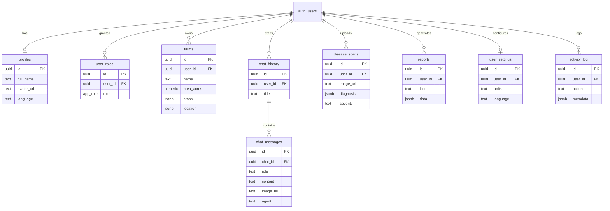

Every public table follows the mandatory pattern: **`CREATE TABLE` → `GRANT` → `ENABLE RLS` → `CREATE POLICY`**. Role checks use a `SECURITY DEFINER` `has_role(uuid, app_role)` function to avoid RLS recursion.

---

## 🤖 AI Architecture

### Intent Router
A lightweight classifier that combines a regex fast-path (greetings, thanks, meta questions) with a Gemini call (temperature 0, 20-token cap) to return exactly one agent name. Never routes greetings or ambiguous messages to the disease agent.

### General Agent
Handles small talk, onboarding, and clarifying questions. Warm, short, in the user's language.

### Disease Agent
Multimodal. Accepts a base64 image + text symptoms, returns disease name, cause, severity, and a step-by-step treatment plan with locally-available Indian products, dosages (g/L, ml/L), and safety notes. A companion `askDiseaseFollowup` server fn preserves image + diagnosis context so the farmer can ask "will neem oil work?" without re-uploading.

### Weather Agent
Turns raw weather context into actionable farming advice: irrigate/spray/harvest/delay decisions.

### Market Agent
Reasons about mandi prices, trends, and sell-vs-hold guidance. Explicitly states when live prices are unavailable and gives directional advice instead of hallucinating numbers.

### Government Agent
Grounded explanations of PM-KISAN, PM-KUSUM, PMFBY, KCC, eligibility, benefits, and how to apply. Always notes users should verify at the official portal.

### Fertilizer Agent
NPK schedules, urea/DAP/MOP dosages, drip/flood/sprinkler irrigation timing tuned to crop and growth stage. Includes soil-health notes.

### Farm Planner
Generates a full season plan as **structured JSON** using Gemini's `response_format: json_object` mode. A tolerant parser handles trailing commas, code fences, and partial outputs before Zod validation.

### Command Center
One-tap "what should I do this week" briefing that fans out across weather, disease risk, and market signals to produce a prioritized action list.

### Gemini + Lovable AI Gateway
All agents go through a single server-only helper:

```ts
// src/lib/ai/gemini.server.ts
callGemini({
  model: "google/gemini-3-flash-preview",
  system, prompt, imageBase64, imageMimeType,
  temperature, maxOutputTokens, jsonMode,
})
```

The gateway (`https://ai.gateway.lovable.dev/v1/chat/completions`) speaks the OpenAI-compatible chat completions protocol and is authenticated with a single `LOVABLE_API_KEY` — no Google Cloud project setup required.

### How Prompts Work
Every agent has a domain-specific system prompt in `run-agent.server.ts`. The user's message is appended with optional `Context:` lines (location, language). Images are inlined as `data:` URLs in a `image_url` content part.

### How Images Are Processed
Client encodes the image to base64 → server fn splits the `data:` prefix → Gemini receives a multimodal `content` array with a `text` part and an `image_url` part. No image ever hits a third-party storage provider mid-flight.

### Structured JSON Responses
For planner + command center, `jsonMode: true` sets `response_format: { type: "json_object" }`. Output flows through: raw text → tolerant JSON parser (strips code fences, fixes trailing commas) → Zod schema validation → typed object → rendered as rich cards.

---

## 🔐 Authentication

### Email Authentication
Standard Supabase email + password flow (`supabase.auth.signInWithPassword`, `signUp`, `resetPasswordForEmail`).

### Google OAuth
Uses the Lovable Cloud Auth wrapper (`src/integrations/lovable/index.ts`):

```ts
lovable.auth.signInWithOAuth("google", {
  redirect_uri: `${window.location.origin}/auth/callback`,
});
```

The dedicated `/auth/callback` route (`src/routes/auth.callback.tsx`) handles both the modern PKCE `code` flow (`exchangeCodeForSession`) and the legacy `access_token`/`refresh_token` hash flow (`setSession`), then navigates to `/dashboard`.

### Protected Routes
All authenticated pages live under the `_workspace` pathless layout. Unauthenticated visitors are redirected to `/login`.

### Server Functions
Every mutating server fn wears `.middleware([requireSupabaseAuth])`. The middleware verifies the Bearer JWT from the request, calls Supabase to resolve the user, and injects `context = { supabase, userId, claims }`. Client-side `functionMiddleware` in `src/start.ts` attaches the token to every RPC.

### Row-Level Security
Every user-facing table has RLS enabled with policies scoped to `auth.uid()`. The `has_role()` `SECURITY DEFINER` function powers admin checks without RLS recursion.

---

## 📦 Installation

### 1. Clone the repository

```bash
git clone https://github.com/your-username/farmgpt-ai.git
cd farmgpt-ai
```

### 2. Install dependencies

```bash
bun install
# or: npm install
```

### 3. Environment Variables

Create a `.env` file at the project root based on `.env.example`:

```bash
# ── Supabase (public — safe in client) ─────────────────────
VITE_SUPABASE_URL=https://<project>.supabase.co
VITE_SUPABASE_PUBLISHABLE_KEY=sb_publishable_xxxxxxxxxxxx
VITE_SUPABASE_PROJECT_ID=<project-ref>

# ── Server-side (never exposed to browser) ────────────────
SUPABASE_URL=https://<project>.supabase.co
SUPABASE_PUBLISHABLE_KEY=sb_publishable_xxxxxxxxxxxx
SUPABASE_SERVICE_ROLE_KEY=sb_secret_xxxxxxxxxxxx      # admin ops only

# ── Lovable AI Gateway (Gemini access) ────────────────────
LOVABLE_API_KEY=lov_xxxxxxxxxxxxxxxxxxxxxxxx

# ── Optional integrations ─────────────────────────────────
WEATHER_API_KEY=                # if adding a live weather provider
MANDI_API_KEY=                  # if adding data.gov.in mandi feed
```

| Variable | Purpose |
|---|---|
| `VITE_SUPABASE_URL` | Client-side Supabase endpoint |
| `VITE_SUPABASE_PUBLISHABLE_KEY` | Publishable (anon) key — RLS-protected |
| `VITE_SUPABASE_PROJECT_ID` | Project ref for storage keys |
| `SUPABASE_URL` | Server-side endpoint (SSR / server fns) |
| `SUPABASE_PUBLISHABLE_KEY` | Server-side publishable key |
| `SUPABASE_SERVICE_ROLE_KEY` | Admin key — used only in `*.server.ts` behind auth checks |
| `LOVABLE_API_KEY` | Auth for the AI Gateway (Gemini) |
| `WEATHER_API_KEY` | Optional live weather provider |
| `MANDI_API_KEY` | Optional mandi price feed |

---

## 🧑‍💻 Running Locally

```bash
bun run dev
# or: npm run dev
```

Vite dev server starts at `http://localhost:8080` with HMR, SSR, and the file-based router regenerating `routeTree.gen.ts` on save.

---

## 🏭 Building for Production

```bash
bun run build
```

Produces a Cloudflare Worker-ready bundle. All npm packages are bundled at build time — there's no runtime module resolution in the Worker.

---

## 🚀 Deploying

| Target | How |
|---|---|
| **Lovable** *(recommended)* | Click **Publish** in the Lovable editor — deploys the Worker + static assets globally |
| **Cloudflare Workers** | `wrangler deploy` against the built output (edge-native, first-class target) |
| **Vercel** | Uses the TanStack Start Vercel adapter; deploy with `vercel` |
| **Netlify** | Uses the Netlify edge adapter; deploy with `netlify deploy` |

Set the same environment variables in your host's dashboard. Never commit `.env` or the service-role key.

---

## 🧬 How AI Works

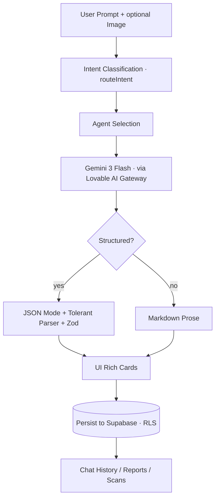

1. **User Prompt** — text + optional image, sent via typed server fn.
2. **Intent Classification** — regex fast-path, else Gemini classifier.
3. **Agent Selection** — one of six specialists.
4. **Gemini Processing** — multimodal call through the gateway.
5. **Structured JSON** — for planner/command-center paths, JSON-mode + tolerant parser + Zod.
6. **UI Cards** — `RichCards.tsx` maps typed blocks to React components.
7. **Database** — response persisted under the user's RLS scope.
8. **History** — chat, scans, and reports become browsable artifacts.

---

## 🛡️ Security

- **Authentication** — Supabase Auth (email + Google OAuth via Lovable Cloud Auth). No anonymous sign-ups.
- **Authorization** — dedicated `user_roles` table + `has_role()` `SECURITY DEFINER` function. **Never** stored on `profiles` (prevents privilege escalation).
- **Row-Level Security** — enabled on every public table; policies scoped to `auth.uid()`.
- **Server-Function Middleware** — `requireSupabaseAuth` verifies the Bearer JWT on every mutating call; unauthenticated calls return 401.
- **Ownership Verification** — e.g. `appendMessage` checks `chat_history` for `chatId + userId` before insert (defense-in-depth beyond RLS).
- **Input Validation** — every server fn validates input via Zod.
- **Error Redaction** — DB errors are logged server-side (`console.error("[server-fn] DB error:", ...)`) and returned to the client as generic messages ("An unexpected error occurred") to prevent information leakage.
- **Secrets** — service-role key lives only in `*.server.ts` files, never bundled to the browser. `LOVABLE_API_KEY` read inside `.handler()` at call time.
- **CSRF & SSRF** — server fns are same-origin POSTs; the AI gateway is a fixed, allow-listed URL.
- **Public API Routes** — anything under `/api/public/*` (webhooks) must verify signatures inside the handler.

---

## ⚡ Performance Optimizations

- **Edge deployment** on Cloudflare Workers — sub-100ms TTFB globally.
- **TanStack Query prefetching** — loaders call `ensureQueryData` so components render instantly with `useSuspenseQuery`.
- **Route-based code splitting** — TanStack Router lazy-loads each route bundle.
- **Server-only modules** (`*.server.ts`) are stripped from client bundles by the code splitter.
- **Streaming AI responses** where the gateway supports it.
- **Tailwind v4 Lightning CSS** — near-zero unused CSS in the shipped bundle.
- **Regex fast-path in the intent router** — greetings skip an LLM call entirely.
- **Multimodal in-request** — images are base64-inlined, avoiding a storage round-trip.
- **RLS-scoped indexed queries** on `user_id + created_at` for chat, scans, and reports.

---

## 🧩 Challenges Faced

1. **OAuth callback loop** — Google sign-in kept returning to `/login`. Solved with a dedicated `/auth/callback` route that handles both PKCE `code` and legacy `access_token`/`refresh_token` hash flows before navigating to `/dashboard`.
2. **Server function auth in SSR prerender** — `requireSupabaseAuth` fns can't run in public-route loaders (no bearer token during build). Enforced convention: protected fns only in `_workspace` loaders or via `useServerFn` inside components.
3. **LLM JSON reliability** — Gemini occasionally emits code fences or trailing commas. Built a tolerant parser + Zod validation pipeline.
4. **Cloudflare Worker constraints** — no `child_process`, no native binaries. Kept all image processing in the browser or as base64 pass-through.
5. **RLS recursion on role checks** — solved with a `SECURITY DEFINER` `has_role()` function called from policies.
6. **Server-fn code-splitter footguns** — handler bodies can't reference module-scope helpers; moved shared logic into imported `.server.ts` modules.
7. **Preventing over-eager routing to the disease agent** — added a regex-based greeting fast-path so "hi" never triggers image analysis.

---

## 🗺️ Future Roadmap

- [x] Multi-agent AI chat
- [x] Crop disease image diagnosis
- [x] Follow-up Q&A on scans (image context preserved)
- [x] AI Farm Planner (structured JSON)
- [x] Command Center weekly briefing
- [x] Persistent reports history
- [x] Google + Email authentication
- [x] Row-Level Security across every table
- [x] Dark mode & fully responsive UI
- [ ] Voice assistant (Hindi + regional languages)
- [ ] WhatsApp bot integration
- [ ] IoT soil sensor ingestion
- [ ] Drone imagery upload & analysis
- [ ] Satellite NDVI analytics
- [ ] Multi-language voice output
- [ ] Live mandi price feed (data.gov.in)
- [ ] Offline-first PWA mode for 2G/low-connectivity villages
- [ ] Community expert marketplace
- [ ] Insurance & credit application deep links

---

## 🤝 Contributing

Contributions of every size are welcome — bug reports, docs fixes, translations, new agents.

1. **Fork** the repo and create a feature branch: `git checkout -b feat/my-feature`
2. **Install** deps: `bun install`
3. **Make** your change — keep TypeScript strict and follow existing patterns.
4. **Run** the type-checker: `bunx tsgo`
5. **Test** locally: `bun run dev`
6. **Commit** with a clear message (conventional commits welcome).
7. **Open a Pull Request** — describe the change, link the issue, add screenshots for UI work.

Please read `AGENTS.md` before adding a new agent — it documents the router contract and system-prompt conventions.

---

## 📜 License

This project is licensed under the **MIT License** — see the [LICENSE](./LICENSE) file for details.

---

## 👤 Author

**Your Name** — Full-Stack & AI Engineer

- 🐙 GitHub: [@your-username](https://github.com/your-username)
- 💼 LinkedIn: [linkedin.com/in/your-handle](https://linkedin.com/in/your-handle)
- 🌐 Portfolio: [your-portfolio.com](https://your-portfolio.com)
- ✉️ Email: `your.email@example.com`

---

## 🆘 Support

- **Bugs** — open a [GitHub Issue](https://github.com/your-username/farmgpt-ai/issues) with reproduction steps, expected vs actual, and browser/OS info.
- **Feature requests** — open a Discussion.
- **Security disclosures** — email the maintainer privately; please don't file public issues for security bugs.

---

## 🙏 Acknowledgements

- **Google** — for Gemini 3 Flash, one of the most capable multimodal models available.
- **Kaggle** — for hosting the AI Agents Capstone Project and pushing the community to build real agentic systems.
- **Lovable** — for the AI-native build environment and AI Gateway that made shipping this in weeks possible.
- **Supabase** — for Postgres, Auth, Storage, and RLS done right.
- **React & TanStack teams** — for React 19, TanStack Start, Router, and Query.
- **shadcn** — for the primitives library this UI is built on.
- **The Open Source Community** — for every issue, tweet, and blog post that shaped this project.
- **Indian farmers** — this app exists because of your work.

---

## 📊 Project Statistics

| Metric | Value |
|---|---|
| 📄 Pages / Routes | 17 |
| 🧩 Components | 50+ (farmgpt + shadcn) |
| 🤖 AI Agents | 6 specialists + 1 intent router |
| 🗄️ Database Tables | 9 |
| 🔌 Server Functions (RPC) | 25+ |
| 🎣 Custom Hooks | 5+ |
| ✨ Features | 20+ user-facing |
| 🧱 UI Cards | 12+ rich card types |
| ♻️ Reusable Components | 40+ shadcn primitives |
| 📦 Folders | 20+ |
| 🖼️ Assets | 15+ |
| 📏 Lines of Code | ~10,000+ TypeScript / TSX |

---

## 🌟 Why This Project Matters

Agriculture feeds the world, and yet the people who feed us have the least access to expert help. A disease outbreak that a trained agronomist could identify in ten seconds can destroy a family's income for a year. A mistimed irrigation can waste a season of water. A missed government scheme can cost tens of thousands of rupees.

**FarmGPT AI puts a team of six domain-expert agents into every farmer's pocket** — a plant doctor, a weather advisor, a market analyst, a scheme navigator, an agronomist, and a friendly generalist — all speaking the farmer's language, all reachable through a single chat box, all backed by state-of-the-art multimodal reasoning.

This isn't a demo. It's a production-grade architecture — typed end-to-end, RLS-secured, edge-deployed, multi-agent — that proves what modern AI + modern web infrastructure can do when they're pointed at a problem that actually matters.

**If we can make one farmer's next harvest bigger, safer, and more profitable, the whole stack was worth building.**

<div align="center">

**Built with ❤️ for Indian farmers · Powered by Gemini · Deployed on the edge**

⭐ **Star this repo if it helped you — it helps other farmers find it too.**

</div>
